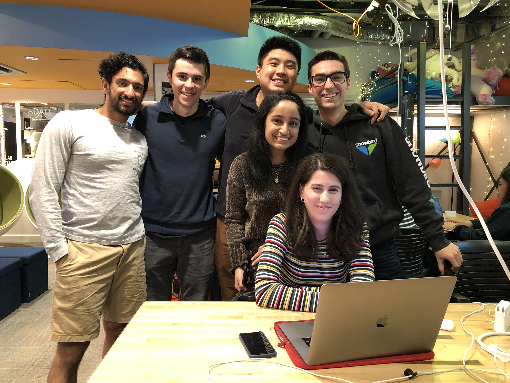

# 📱project-boost-web


team photo + sofia!

## 🎨 Design

https://www.figma.com/file/YOd5zqcyhMSz66wYNJ39lh3w/Boost-CS52-19S?node-id=1%3A6

## ⚙️ Setup Steps 

## 📐 Architecture

```
├──[project-boost-web]/       # root directory
|  └──[src]                   # holds all of the source code for the website
|     └──[assets]               # manages Swift/Xcode dependencies
|     └──[components]               # manages Swift/Xcode dependencies'
|     └──[services]               # manages Swift/Xcode dependencies
|     └──[Podfile]               # manages Swift/Xcode dependencies
|     └──[index.js]               # manages Swift/Xcode dependencies
```

## 🛠️ Installation

1. If you don't have homebrew installed, install it by following the instructions linked [here](https://brew.sh/).
2. If you don't have yarn installed, install it by  following the instructions linked [here](https://yarnpkg.com/en/docs/install#mac-stable).

## 🧰 Setting Up Project

- `git clone https://github.com/dartmouth-cs52-19S/project-boost-web`
- `cd project-boost-web`
- `yarn install`


## 🏃‍♀️ Running Dev Environment

- `cd` into root directory
- `yarn start`
- navigate to [localhost:8080](localhost:8080) i order to see the website

## 🚀 Deployment

Deployed using Surge. 
Website can be found at [https://project-boost.surge.sh/](https://project-boost.surge.sh/).

## 👵 Authors

Thomas Monfre '21,
Robert He '20,
Faustino Cortina '21,
Varsha Iyer '21,
Syed Tanveer '21

## 💓 Acknowledgments

We would like to thank Tim for being a great prof and providing a wealth of knowledge, and Sofia for being an amazing resource for help and support. Also thank you to stack overflow, and just generally google.
