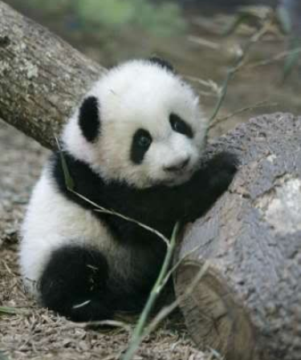

# The moderate user

## Background and Demographic Information
  * _Fictional Name_: Pandy the Panda
  * _Demographics_: Freshman in college
  * _Overheard quote_: I’m a freshman in college right now and I’m having trouble transitioning into college. My mom used to help me plan out my day and force me to work. Now, I get distracted very easily."

## Narrative

*Short narrative or description about the user and why they're using your product/service (try to capture their attitudes, needs, problems/concerns, and experience)*

  * A moderate user of the app that would use it in order to maximize their productivity while a  ttending school. They would me very motivated to figure out the best spaces for their productivity, the best times that they might be productive throughout the day, and would would use the app in order to achieve those goals.
  
## Behavioral and Dimensional Information
  * __Goals and Motivations:__
    * Motivate the user to be productive.
    * Help the user structure their day. 
    * Help the user figure out where they’re productive. 
    * Train the user to be productive by helping them identify their places for improvement.
  * __Tasks:__
    *(break goals down into tasks — what does the user need to do to accomplish a particular goal)*
    * a
  * __Pain Points, Concerns, and Challenges:__
    *(what are they worried about? what do they have trouble with?)*
    * I have so much going on that I dont even know when im productive

I have problems structuring my day 
    * I like to know when im productive. 
    * I need something to remind me to be productive
  * _User Flow_
    *(describe a typical scenario of the user interacting with your product – this is a short ordered list of actions)*
    * User creates an account
    * Gets data from google
    * Uploads data to website
    * Download App
    * App will use previous locations user has spent time at and ask questions in regards to it
    * User will be able to see analysis